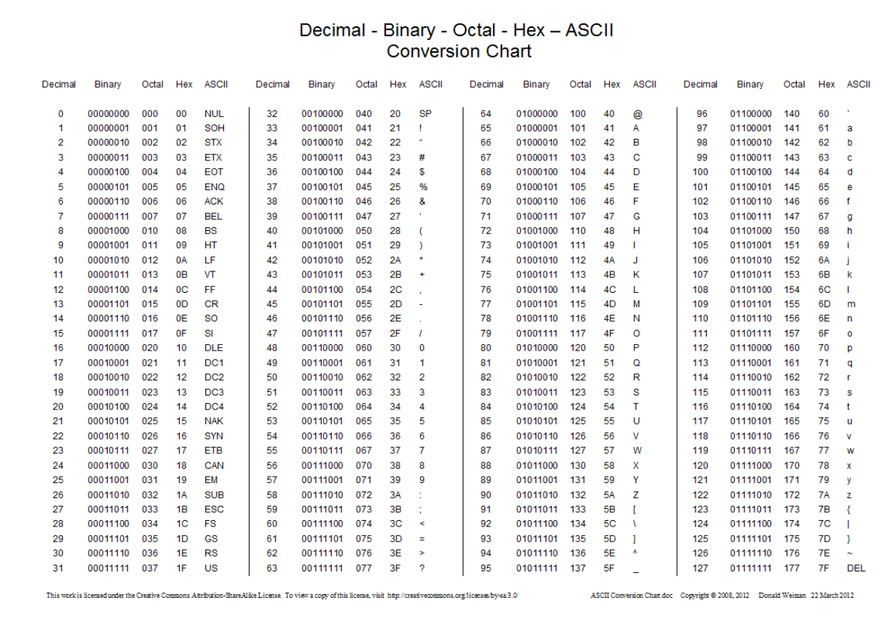

# คำถาม 
### 2.1 สังเกตผลจากการรันโคิดในส่วน 2.1 ว่าตรงตามหลักการทางคณิตศาสตร์หรือไม่ เพราะเหตุใด
### ตอบ ได้ผลลัพธ์ถูกต้อง เพราะยังอยู่ในช่วงค่าปกติของ int
---
### 2.2 สังเกตผลจากการรันโคิดในส่วน 2.2 ว่าตรงตามหลักการทางคณิตศาสตร์หรือไม่ เพราะเหตุใด
### ตอบ ถูกต้อง เพราะยังไม่เกินค่ามากสุดของ int
---
### 2.3 สังเกตผลจากการรันโคิดในส่วน 2.3 ว่าตรงตามหลักการทางคณิตศาสตร์หรือไม่ เพราะเหตุใด
### ตอบ ไม่ถูกตามคณิต เพราะค่ามันล้น (Overflow) เลยกลายเป็นเลขลบ
---
### 2.4 สังเกตผลจากการรันโคิดในส่วน 2.4 ว่าตรงตามหลักการทางคณิตศาสตร์หรือไม่ เพราะเหตุใด
### ตอบ ถูกต้อง เพราะยังเป็นค่าต่ำสุดที่ int รับได้พอดี
---
### 2.5 สังเกตผลจากการรันโคิดในส่วน 2.5 ว่าตรงตามหลักการทางคณิตศาสตร์หรือไม่ เพราะเหตุใด
### ตอบ ไม่ถูก เพราะมันล้นลงไปอีก (Underflow) เลยกลายเป็นเลขบวก
---
# คำถาม
### 3.1 คุณสังเกตเห็นความแตกต่างของความแม่นยำระหว่าง float และ double อย่างไร?
### ตอบ float แสดงทศนิยมได้ประมาณ 6–7 ตำแหน่งเท่านั้น ส่วน double แสดงได้แม่นกว่าถึงประมาณ 15 ตำแหน่ง double แม่นยำกว่า float มาก
---
### 3.2 สถานการณ์ใดที่คุณควรเลือกใช้ double แทน float?
### ตอบ ถ้าต้องใช้เลขทศนิยมที่ แม่นมากๆ เช่น พิกัด GPS งานวิจัย หรือการเงินที่ทศนิยมสำคัญ คำนวณทางวิทยาศาสตร์ ควรใช้ double แทน float
---
# คำถาม
### 4.1 ค่าตัวเลข (ASCII value) มีความสัมพันธ์กับอักขระอย่างไร?
### ตอบ ตัวอักขระ (เช่น 'Z') มีค่าเบื้องหลังเป็นตัวเลขที่เรียกว่า ASCII เช่น 'Z' = 90, 'z' = 122 อักขระแต่ละตัวมีเลขประจำตัว
---
### 4.2 ถ้าอยากทราบความสัมพันธ์ระหว่างตัวเลขกับอักขระทั้งหมด สามารถหาได้จากเอกสารใด หรือแหล่งอ้างอิงใด
### ตอบ ดูได้จาก ตาราง ASCII (ASCII table)

---
### 4.3 จากข้อ 4.2 นักเขียนโปรแกรมสามารถกำหนดขึ้นเองได้ หรือมีเอกสารใดกำกับอยู่
### ตอบ นักเขียนโปรแกรม ไม่สามารถกำหนดเองได้ เพราะค่าพวกนี้ถูกกำหนดมาตรฐานไว้แล้วใน เอกสารชื่อ ASCII (American Standard Code for Information Interchange) เป็นมาตรฐานกลางที่ทุกระบบใช้ร่วมกัน
---
# คำถาม
### 5.1 true และ false ถูกแสดงผลเป็นค่าใดบน Serial Monitor?
### true ถูกแสดงเป็น 1 และ false ถูกแสดงเป็น 0 เพราะในภาษา C++ (รวมถึง ESP32) ค่าของ bool จะถูกแทนด้วยเลข true = 1 false = 0
---
# คำถาม
### 6.1 บน ESP32, long มีขอบเขตเท่ากับ int หรือไม่?
### ตอบ มีขอบเขตเท่ากัน — บน ESP32 long คือ 32-bit เหมือน int เก็บได้ประมาณ -2.1 พันล้าน ถึง +2.1 พันล้าน
---
### 6.2 ชนิดข้อมูลใดที่ต้องใช้หากต้องการเก็บค่าจำนวนเต็มบวกที่ใหญ่ที่สุด?
### ตอบ ต้องใช้ unsigned long long เพราะมันเป็น 64-bit และไม่มีค่าลบ เก็บได้ถึงประมาณ 18,446,744,073,709,551,615 (1.8e19) ซึ่งเยอะที่สุดในชนิดพื้นฐาน
---
# คำถาม
* ### เมื่อ myByte ถูกกำหนดให้เป็น 256 ผลลัพธ์ที่ได้คืออะไร และเพราะเหตุใด?
### ตอบ ผลลัพธ์คือ 0 byte เก็บค่าได้แค่ 0 ถึง 255 (8 บิต)เลข 256 มันเกินขอบเขต → เลย วนกลับเป็น 0 (เหมือนล้น หรือ overflow)
---

